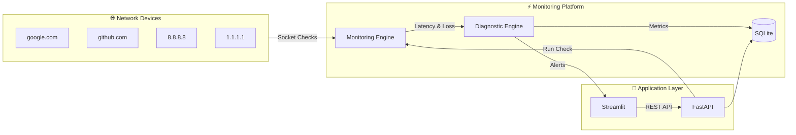

# 🌐 Network Performance Monitoring & Automated Diagnostic System

<div align="center">


**A real-time network monitoring system that tracks latency, packet loss, and device health across multiple devices simultaneously — with automated diagnostics, REST API, and live dashboard.**

[🚀 Live API](https://web-production-990d4.up.railway.app) • [📖 Swagger Docs](https://web-production-990d4.up.railway.app/docs) 

</div>

---

## 📸 Dashboard Screenshots

### Full Dashboard — Real Time Monitoring


<!-- SCREENSHOT 1: Paste your dashboard overview screenshot here -->
<!-- To add: Click Edit → then drag and drop your screenshot image here -->

> Dark pink/purple themed real-time dashboard showing AVG RTT, packet loss, health score, device status, latency charts, and alerts panel — all populated from live network checks.

### Network Degradation vs Recovery


<!-- SCREENSHOT 2: Paste your worst/best case screenshot here -->
<!-- To add: Click Edit → then drag and drop your screenshot image here -->

> Left: After clicking 🔴 WORST CASE — latency spikes to 400-600ms, packet loss jumps to 20-45%, health score drops, donut turns red.
> Right: After clicking 🟢 BEST CASE — latency recovers to 5-10ms, packet loss 0%, health score back to 100.

---

## 🎯 What This Project Does

This system monitors multiple network devices **simultaneously** and automatically diagnoses network health — similar to enterprise tools like Datadog, Nagios, and Grafana.

### Problems it solves
- Manual network checking is slow and misses issues
- No history of when problems occurred
- No way to monitor multiple devices at the same time
- No automated alerts when something goes wrong

### How it solves them
- Threads check all devices **simultaneously** — not one by one
- Every result saved to **SQLite database** permanently
- **Automated diagnostic rules** classify issues and recommend fixes
- **9-endpoint REST API** exposes all data for any frontend or integration
- **Live dashboard** shows real-time charts with one-click monitoring

---

## 🏗️ Detailed Architecture



---

## 🛠️ Tech Stack

| Layer | Technology | Purpose |
|---|---|---|
| Language | Python 3.11 | Core language |
| Networking | `socket` module | TCP connectivity + latency |
| System commands | `subprocess` | Windows ping command |
| Concurrency | `threading` | Parallel device monitoring |
| Web framework | FastAPI | REST API backend |
| Web server | Uvicorn | ASGI server |
| Database | SQLite + sqlite3 | Persistent storage |
| Dashboard | Streamlit | Web UI |
| Charts | Plotly | Interactive visualizations |
| Data processing | Pandas | DataFrame operations |
| Logging | Python logging | Rotating file logs |
| Testing | pytest | 68 automated tests |
| Deployment | Railway + Streamlit Cloud | Cloud hosting |

---

## 📁 Project Structure

```
network_monitor/
│
├── monitoring/                  # Core network measurement
│   ├── latency.py               # Socket + ping latency
│   ├── packet_loss.py           # Packet loss calculation
│   ├── connectivity.py          # Full connectivity checker
│   └── thread_monitor.py        # Multi-device threading
│
├── diagnostics/                 # Automated analysis
│   └── analyzer.py              # Rule engine + alerts
│
├── api/                         # REST API
│   ├── main.py                  # FastAPI app entry point
│   ├── models.py                # Request/response schemas
│   └── routes/
│       ├── devices.py           # /devices endpoints
│       ├── metrics.py           # /metrics endpoints
│       └── alerts.py            # /alerts endpoints
│
├── database/                    # Data persistence
│   └── db.py                    # SQLite CRUD operations
│
├── dashboard/                   # Visualization
│   ├── app.py                   # Streamlit main app
│   └── components/
│       ├── cards.py             # Metric cards + CSS theme
│       └── charts.py            # Plotly chart functions
│
├── logs/                        # Auto-generated log files
│   ├── performance.log          # All activity
│   └── errors.log               # Warnings and errors only
│
├── tests/                       # Automated test suite
│   ├── test_latency.py          # 68 tests total
│   ├── test_packet_loss.py      # 0 failures
│   ├── test_connectivity.py
│   ├── test_diagnostics.py
│   ├── test_database.py
│   └── test_api.py
│
├── requirements.txt
├── Procfile
├── .env
├── .gitignore
└── README.md
```

---

## 🚀 Quick Start — Run Locally

### Prerequisites
- Python 3.11+
- Windows / Linux / Mac
- Internet connection

### Installation

```bash
# 1. Clone the repository
git clone https://github.com/Spurthi-019/network-monitor.git
cd network-monitor

# 2. Create virtual environment
python -m venv venv

# 3. Activate virtual environment
# Windows PowerShell:
venv\Scripts\activate
# Mac/Linux:
source venv/bin/activate

# 4. Install dependencies
pip install -r requirements.txt

# 5. Set up database
python database/db.py
```

### Running the project

Open **two terminals** and run one command in each:

**Terminal 1 — Start API backend:**
```bash
uvicorn api.main:app --reload --host 0.0.0.0 --port 8000
```

**Terminal 2 — Start Dashboard:**
```bash
streamlit run dashboard/app.py
```

**Open in browser:**
```
API Documentation:  http://localhost:8000/docs
Live Dashboard:     http://localhost:8501
```

### Add devices and start monitoring

```bash
# Add devices via API (or use Swagger UI at /docs)
curl -X POST http://localhost:8000/devices \
  -H "Content-Type: application/json" \
  -d '{"host": "google.com", "port": 80, "label": "Google"}'

# Run monitoring
curl -X POST http://localhost:8000/monitor \
  -H "Content-Type: application/json" \
  -d '{}'
```

---

## 🔌 API Endpoints

| Method | Endpoint | Description |
|---|---|---|
| GET | `/` | API health check |
| GET | `/devices` | List all monitored devices |
| POST | `/devices` | Add a new device |
| DELETE | `/devices/{host}` | Remove a device |
| POST | `/monitor` | Trigger monitoring run NOW |
| GET | `/metrics` | Get full monitoring history |
| GET | `/metrics/summary` | Per-device averages |
| GET | `/status` | Overall network health |
| GET | `/alerts` | All diagnostic alerts |
| GET | `/alerts?severity=CRITICAL` | Filter by severity |

---

## 📊 Dashboard Features

### Three monitoring modes
| Button | What it does |
|---|---|
| ⚡ RUN CHECK | Real network check using actual ping |
| 🔴 WORST CASE | Simulates 400-600ms latency + 20-45% packet loss |
| 🟢 BEST CASE | Simulates 5-10ms latency + 0% packet loss |

### Six real-time charts
| Chart | What it shows |
|---|---|
| Latency Over Time | Line chart with warning/critical threshold lines |
| Packet Loss per Device | Bar chart with 2% threshold |
| Latency per Device | Horizontal bar comparison |
| Network Health Donut | Healthy / degraded / offline breakdown |
| Uptime per Device | Percentage uptime horizontal bars |
| Device Status Table | Full per-device summary |

### Info strip (top bar)
Shows: total devices, total runs, success rate, best device, worst device, last updated time — all calculated live from database.

---

## 🔍 How It Works Internally

### 1. Socket-based latency measurement
```python
sock = socket.socket(socket.AF_INET, socket.SOCK_STREAM)
sock.settimeout(3)
start = time.time()
sock.connect_ex((host, port))
latency = (time.time() - start) * 1000  # milliseconds
```

### 2. Multi-threading — all devices checked simultaneously
```python
for host, port in targets:
    thread = threading.Thread(
        target=monitor_single_device,
        args=(host, port)
    )
    thread.start()
# Wait for all threads to complete
for thread in threads:
    thread.join()
```
Without threading: 4 devices × 3 seconds = **12 seconds**
With threading: all 4 simultaneously = **3 seconds** (75% faster)

### 3. Automated diagnostic rules (priority order)
```python
RULES = [
    rule_device_offline,    # checked first — highest priority
    rule_high_latency,      # latency > 150ms → WARNING
    rule_packet_loss,       # loss > 2% → WARNING
    rule_healthy,           # fallback — all clear
]
```

### 4. Health scoring system
```
Score starts at 100
Each CRITICAL issue:  -25 points
Each WARNING issue:   -10 points
Minimum score:         0
```

### 5. Automated logging
```
logs/performance.log  ← INFO and above (all activity)
logs/errors.log       ← WARNING and above (problems only)
Both files rotate at 5MB — keeps last 3 backups automatically
```

---

## 🧪 Testing

```bash
# Run all 68 tests
pytest tests/ -v

# Run specific module
pytest tests/test_latency.py -v
pytest tests/test_api.py -v
```

**Results: 68 passed, 0 failed**

| Test File | What it covers | Tests |
|---|---|---|
| test_latency.py | Socket + ping measurement | 10 |
| test_packet_loss.py | Loss calculation + labels | 8 |
| test_connectivity.py | Full connectivity checker | 6 |
| test_diagnostics.py | Rule engine + scoring | 12 |
| test_database.py | All CRUD operations | 17 |
| test_api.py | All REST endpoints | 15 |

---

## 🌐 Deployment

| Component | Platform | URL | Status |
|---|---|---|---|
| FastAPI Backend | Railway | https://web-production-990d4.up.railway.app | ✅ Live |
| API Swagger Docs | Railway | https://web-production-990d4.up.railway.app/docs | ✅ Live |
| Streamlit Dashboard | Streamlit Cloud | [https://network-monitor-019.streamlit.app ](http://localhost:8501/)| ✅ Local host |
| Source Code | GitHub | https://github.com/Spurthi-019/network-monitor | ✅ Public |

**Deployment architecture:**
- FastAPI reads `Procfile` → Railway runs `uvicorn api.main:app`
- Every `git push` triggers automatic redeployment on both platforms
- Dashboard reads `dashboard/requirements.txt` on Streamlit Cloud

---

## 📝 Sample Log Output

```
2024-01-15 14:23:01 | INFO    | monitoring started — 4 devices
2024-01-15 14:23:04 | INFO    | host=google.com | latency=23.1ms | loss=0.0% | health=excellent
2024-01-15 14:23:04 | INFO    | host=8.8.8.8 | latency=11.4ms | loss=0.0% | health=excellent
2024-01-15 14:23:04 | INFO    | host=github.com | latency=190.3ms | loss=0.0% | health=good
2024-01-15 14:23:04 | ERROR   | host=192.168.1.1 | health=offline | Device timed out
2024-01-15 14:23:04 | WARNING | 1 device(s) OFFLINE
2024-01-15 14:23:04 | INFO    | round complete — score=75/100
```

---

## 🎓 Concepts Learned

| Concept | Where applied |
|---|---|
| Socket programming | `monitoring/latency.py` — TCP connections |
| Multi-threading + locks | `monitoring/thread_monitor.py` |
| REST API design | `api/routes/` — GET/POST/DELETE endpoints |
| Pydantic validation | `api/models.py` — request/response schemas |
| Database design | `database/db.py` — 3 tables, SQL queries |
| Data aggregation | `GROUP BY`, `AVG()`, `COUNT()` in SQL |
| Real-time dashboards | `dashboard/app.py` — Streamlit + Plotly |
| Automated testing | `tests/` — pytest fixtures, assertions |
| Logging pipelines | `logger_setup.py` — rotating file handlers |
| Cloud deployment | Railway + Streamlit Cloud + GitHub CI/CD |

---

## 👤 Author

**Spurthi**
GitHub: [@Spurthi-019](https://github.com/Spurthi-019)

---

## 📄 License

This project is open source and available under the [MIT License](LICENSE).

---

<div align="center">

Built from scratch — socket programming → threading → FastAPI → SQLite → Streamlit → deployed 🚀

</div>
